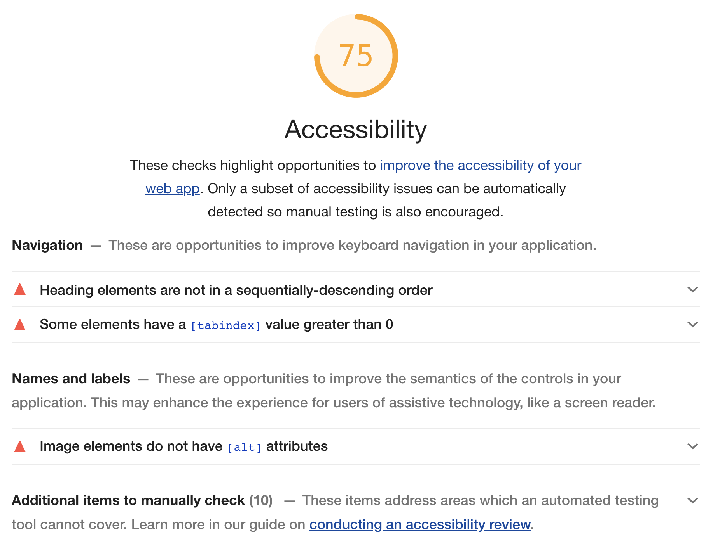

> _Fork_ deze leertaak en ga aan de slag. Onderstaande outline ga je gedurende deze taak in jouw eigen GitHub omgeving uitwerken. De instructie vind je in: [docs/INSTRUCTIONS.md](docs/INSTRUCTIONS.md)

# Rapportage webtoegankelijkheid-test voor {Frontend Design & Development}
*Dit document is een format voor een webtoegankelijkheid-test volgens de Web Content Accessibility Guidelines (WCAG). Een consistente rapportageformat helpt bij het uitvoeren van effectieve evaluaties en schept de mogelijkheid voor accurate vergelijking van toegankelijkheid over tijd en tussen verschillende websites.*

Datum webtoegankelijkheid-test: {datum}

Webtoegankelijkheid-test uitgevoerd door: {naamt}

## Inhoudsopgave

  * [Samenvatting](#samenvatting)
  * [Achtergrond bij de evaluatie](#achtergrond-bij-de-evaluatie)
  * [Afbakening](#afbakening)
  * [Beoordelaars](#beoordelaars)
  * [Beoordelingsproces](#beoordelingsproces)
  * [Resultaten en aanbevelingen](#resultaten-en-aanbevelingen)
  * [Referenties](#referenties)
  * [Bijlagen](#bijlagen)
  * [Licentie](#licentie)

## Samenvatting

Dit rapport beschrijft in hoeverre de website {naam van de website} overeenstemt met de *Web Content Accessibility Guidelines (WCAG)* van het W3C. Na wat achtergrondinformatie en afbakening van de beoordeling worden beoordelaars en het beoordelingsproces wordt beschreven dat gebaseerd is op verschillende bronnen welke zijn beschreven in de bijlagen.

Conslusie van deze test luidt dat de {Frontend Design & Development} website {niet voldoet/ voldoet/ dichtbij voldoen is aan} de WCAG 2.1, op niveau {A/ AA/ AAA}. Gedetailleerde resultaten en aanbevelingen zijn verderop in dit document beschikbaar en in de referenties vindt u bronnen voor eventuele vervolgstudie. Wij stellen feedback op deze evaluatie zeer op prijs.

## Achtergrond bij de evaluatie

De webtoegankelijkheid-test vereist een combinatie van semi-geautomatiseerde en handmatig uitgevoerde evaluatie tools door een ervaren beoordelaar. De beoordelingsresultaten in dit rapport zijn gebaseerd op een beoordeling welke is uitgevoerd op {datum}. De website kan ondertussen aangepast zijn.

## Afbakening

{Naam van de website}

{en doel van de website, wanneer relevant}

{Base URL van de website}

{Lijst met URLs die in de beoordeling meegenomen zijn}

{Als de website dynamisch is, screenshots van hetgeen beoordeeld is}

{Indicatie van pagina’s die handmatig beoordeeld zijn ten opzichte van semi-geautomatiseerde tools}

{URLs die niet beoordeeld zijn}

{Exacte datum, of reeks van data waarop beoordeling heeft plaatsgevonden}

{Natuurlijke taal/talen van de website}

## Beoordelaars

{Naam van de beoordelaar of het beoordelingsteam, tenzij anoniem}

{Organisatie waar de beoordelaars mee geaffilieerd zijn, wanneer relevant en als niet anoniem}

{Contactinformatie van de beoordelaar(s), tenzij anoniem}

{Expertisegebied van de beoordelaars op basis van naamgeving in de referentie: “Informatie over het gebruik van gecombineerde expertise voor het evalueren van webtoegankelijkheid”}

{Niveau van natuurlijke taal/talen waarin de beoordelaar(s) communiceert/communiceren}

## Beoordelingsproces

{Benoem het WCAG 2.1 niveau waarvoor de beoordeling is uitgevoerd, bv. WCAG 2.1 Niveau A, AA of AAA}

{Benoem de beoordelings- en evaluatietools en versies van de tools die gebruikt zijn}

{Beschrijf hoe handmatige beoordeling is uitgevoerd, bv. usability test of toegankelijkheidstest aan de hand van A11Y Project-checklist}

## Resultaten en aanbevelingen

{Samenvatting van beoordelingsresultaten, bv. deze website {voldoet/ voldoet niet/ is dichtbij aan voldoen} aan de WCAG 2.1, op niveau A, AA of AAA.}

### Sterke punten
{Samenvatting van de de sterke punten ...}

### Ontoegankelijke punten
{Samenvatting van ontoegankelijke punten ...}

### Checklist 

{Beschijf de resultaten van de hele test. gebruik hiervoor de A11Y Project-Checklist}

- Content
- Global code
- Keyboard
- Images
- Headings
- Lists
- Controls
- Tables
- Forms
- Media
- Video
- Audio
- Appearance
- Animation
- Color contrast
- Mobile and touch

{Schrijf per check wat er uit de test is gekomen}

{Neem links op naar de WCAG 2.1 succescriteria en technieken voor de ontoegankelijke punten}

{Voeg per check specifieke rapportage(s), of links naar rapportage(s) toe in de Wiki, bv. screenshots van tests}

{Schrijf per check aanbevelingen voor het verbeteren van ontoegankelijke punten}

{Beschrijf of verwijs per check naar een programma voor het monitoren van webstite toegankelijkheid, her-beoordeling aan de hand van beoordelingsinstrumenten etc.}

## Referenties

Referenties welke gebruikt zijn bij de webtoegankelijkheid-test. Deze referenties zijn allen in het Engels:

- [Overzicht en introductie van de Web Content Accessibility Guidelines (WCAG)](https://www.w3.org/WAI/intro/wcag)
- [De complete Web Content Accessibility Guidelines 2.1 (WCAG)](https://www.w3.org/TR/WCAG21/)
- [Technieken voor WCAG 2.1](https://www.w3.org/WAI/WCAG21/Techniques/)
- [Bronnen voor beoordeling van webtoegankelijkheidsevaluatie ](http://www.w3.org/WAI/eval/)
- [Tools lijst voor semi-geautomatiseerde beoordeling van webtoegankelijkheid](https://www.w3.org/WAI/ER/tools/)
- [Informatie over het gebruik van gecombineerde expertise voor het evalueren van webtoegankelijkheid](https://www.w3.org/WAI/eval/reviewteams)
- [A11Y Project Checklist](https://www.a11yproject.com/checklist/)

{Vul aan waar nodig, haal weg wat niet relevant is}

## Bijlagen

Verwijzen naar bijlagen, screenshots en testuitslagen in de Wiki.

<!--
Lighthouse accessibility score voor verbeteringen:

-->

[Einde van het template]

## Licentie

This work is licensed under [GNU GPLv3](./LICENSE).
